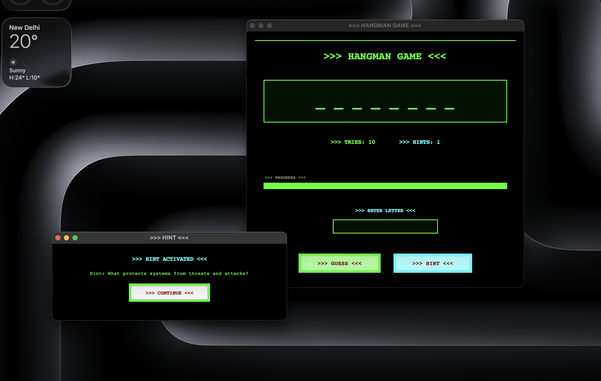

# 🎮 Hangman Game

A classic Hangman word-guessing game built with Python and Tkinter, featuring a retro terminal-style GUI with vibrant colors and smooth animations.



## ✨ Features

- **Retro Terminal Design**: Classic green-on-black terminal aesthetic with ASCII-style borders
- **35 Programming Words**: Word bank focused on programming and technology terms
- **Hint System**: Get 2 helpful hints per game to assist with guessing
- **Visual Feedback**: 
  - Color-coded tries counter (green → amber → red)
  - Progress bar showing remaining attempts
  - Animated feedback messages
  - Button shake animations for wrong guesses
- **Win/Lose Screens**: Retro-styled victory and game over screens
- **Smooth Animations**: Retro pulse effects and visual feedback
- **User-Friendly Interface**: Clean layout with clear instructions

## 🎯 How to Play

1. **Guess Letters**: Enter a single letter in the input field and click ">>> GUESS <<<" or press Enter
2. **Use Hints**: Click ">>> HINT <<<" button or type "hint" in the input field to get a clue (2 hints available per game)
3. **Win Condition**: Guess all letters in the word before running out of tries
4. **Lose Condition**: You lose if you make 10 wrong guesses

## 🚀 Installation

### Prerequisites

- Python 3.x
- Tkinter (usually included with Python)

### Running the Game

1. Clone the repository:
```bash
git clone https://github.com/Tharun-M-16/Hangman-Game.git
cd Hangman-Game
```

2. Run the game:
```bash
python3 main3.py
```

## 📋 Game Rules

- You have **10 tries** to guess the word
- You have **2 hints** available per game
- Each hint provides a clue question to help you guess
- Wrong guesses are displayed in red
- Progress bar shows your remaining attempts
- Tries counter changes color based on remaining attempts:
  - 🟢 Green: 7-10 tries left
  - 🟠 Amber: 4-6 tries left
  - 🔴 Red: 1-3 tries left

## 🎨 Word Categories

The game includes 35 words related to:
- Programming languages (Python, etc.)
- Software development (developer, programming, etc.)
- Computer hardware (computer, keyboard, monitor, etc.)
- Technology concepts (algorithm, encryption, security, etc.)
- Development tools (framework, library, module, etc.)

## 🛠️ Technologies Used

- **Python 3**: Core programming language
- **Tkinter**: GUI framework for the graphical interface
- **Random**: For word selection

## 📸 Screenshots

The game features a retro terminal-style interface with:
- Bright green text on black background
- ASCII-style borders and decorations
- Color-coded feedback system
- Smooth animations and transitions

## 🎮 Game Features in Detail

### Hint System
- Each word has 2 unique hints
- Hints are displayed in a pop-up window
- Hints provide contextual clues about the word

### Visual Elements
- **Word Display**: Large, bold letters showing guessed letters and blanks
- **Progress Bar**: Visual representation of remaining attempts
- **Color Coding**: 
  - Green: Correct guesses, hints available
  - Red: Wrong guesses, low tries
  - Cyan: Hint button, hint text
  - Amber: Warning state

### Animations
- Button shake effect on wrong guesses
- Word pulse animation on correct guesses
- Smooth color transitions
- Flash feedback messages

## 🤝 Contributing

Contributions are welcome! Feel free to:
- Add more words to the word bank
- Improve the UI/UX
- Add new features
- Fix bugs
- Enhance animations

## 📝 License

This project is open source and available for educational purposes.

## 👤 Author

**Tharun-M-16**

- GitHub: [@Tharun-M-16](https://github.com/Tharun-M-16)

## 🙏 Acknowledgments

- Classic Hangman game concept
- Retro terminal aesthetic inspiration
- Python Tkinter community

---

**Enjoy playing Hangman! 🎯**

